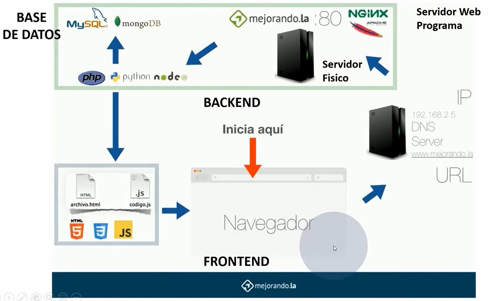
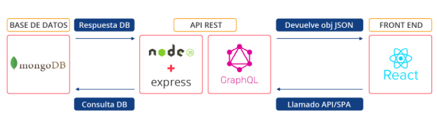

# Artmotics 🚀

Proyecto oficial de desarrollo de software

# Objetivos 🎯

En los grupos de investigación de las diferentes universidades se desarrollan diversos tipos de proyectos de investigación y se detectan dificultades en el cumplimiento del plan de trabajo de dicha investigación. Mediante los reportes de avance del proyecto se controlará el progreso parcial del proyecto de investigación. Nos proponemos plantear un modelo de sistema de información que soporte la gestión de proyectos de investigación y mejore los procesos. Se propone analizar, diseñar y construir una aplicación software que permita controlar cada una de las fases de los grupos de investigación de las universidades.
Se tendran 5 modulos en la aplicación:
1) Módulo de gestión de usuarios.
2) Módulo de gestión de proyectos.
3) Módulo de gestión de inscripciones
4) Módulo de gestión de avances. 

## Autores ✒️

_ScrumTeam_

- **Cristian C**: - _Desarrollador_ - [User](https://github.com/)
- **Abelardo C**: - _Analista_ - [User](https://github.com/)
- **Robinson A**: - _Product Owner_ - [User](https://github.com/)
- **José De Jesús Barajas Sotelo**: - _Administrador BD_ - [GitHub Profile](https://github.com/jdbarajass)
- **Kevin David Guevara Manosalva**: - _Scrum Master_ - [GitHub Profile](https://github.com/KevinG090)

## Construido con 🛠️

_las herramientas usadas para crear el proyecto_

- [React JS](https://es.reactjs.org/)
- [HTML 5 ](http://html5.com/)
- [CSS3 ](http://www.css3.com/)
- [Lenguaje JavaScript ](https://www.javascript.com/)
- [Lenguaje TypeScript ](https://www.typescriptlang.org/)
- [Java ](https://www.java.com/es/)
- [Node Js](https://nodejs.org/es/)
- [Plataformas de desarrollo para Backend (Node JS)](https://nodejs.org/en/)
- [Stack MEAN / MERN](https://en.wikipedia.org/wiki/MEAN_(solution_stack))
- [JWT / Oatuh 2]()
- [Heroku](https://www.heroku.com/)
- [Git / GitHub](https://github.com/)

# Descripción desarrolladores 📑:

- **Cristian C**: Descipción

- **Abelardo C**: Un saludo a todos, soy un entusiasta de la programación y he aprendido mucho en esta experiencia de misión tic que espero poder aplicar en mi campo, aunque soy una persona mayor me encanta poder compartir experiencias con la gente joven. 

- **Robinson A**: Hi everybody! I am in this wonderful world of software development, learning new technologies, with the aim of supporting my team.  

- **José De Jesús Barajas Sotelo**: ¡Hola! Soy estudiante desarrollador joven colombiano. Decidí involucrarme en el mundo de la tecnología con mi carrera como Ing. en control y automatización, ya que me fascina y es la trayectoria que sigue el mundo. Tengo conocimientos en electrónica, instrumentación, automatización y control; manejo lenguajes de programación como C++, Java, Labview, JavaScript, Python, Matlab, R studio, entre otros.

- **Kevin G**: Currently I'm learning to be a Front-End developer, I'm excited to contribute to my current team.

## Licencia 📄

Este proyecto está bajo la Licencia (MIT LICENSE) - mira el archivo [LICENSE.md](https://github.com/hubotio/hubot/blob/master/LICENSE.md) para detalles

## Link De Trello en donde se aplicá la medología Scrum
- [Click para acceder al link de trello del equipo artmotics](https://trello.com/b/5LcpSa5R/artmotics)

- ## Diagrama de funcionamiento de un sitio Web 🛠️👩‍💻👨‍💻

- ## Arquitectura final del proyecto 🛠️

